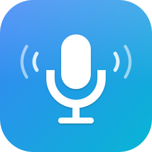

# dictate

<p align="left">
  
</p>

**Privacy-first, self-hosted voice typing for macOS.** Hold **Cmd+H** to dictate into any app.

- 🔒 **100% local by default** — Whisper for speech-to-text, Ollama for cleanup. Nothing leaves your machine.
- ☁️ **Optional cloud cleanup** via OpenRouter when you want a bigger model. Secrets are auto-redacted before send.
- 🧠 **Context-aware** — picks code / chat / prose presets based on the focused app.
- 📝 **Selection-as-context** — select text, dictate an instruction, get the rewrite.
- 🛡️ **Secret redaction** — API keys, env vars, password phrases scrubbed before any cloud call.
- 🔁 **Correction learning** — your Cmd+Z edits become few-shot examples for next time.
- 🖥️ **Private web UI** — review every transcript on `127.0.0.1` only. No telemetry, ever.
- 📋 **Clipboard-paste insertion** — single Cmd+Z undo, full Unicode.

## Install

```bash
git clone https://github.com/lewiswigmore/dictate.git ~/dictate
cd ~/dictate
./install.sh --with-ollama        # installs Python deps + Ollama + default model
./install.sh --autolaunch         # (optional) start at login, restart on crash
./run.sh
```

That's it — no API keys, no cloud account.

## Install via Homebrew (coming soon)

The manual install above is the primary v0.1 path. Homebrew tap setup is tracked in [docs/homebrew-tap.md](./docs/homebrew-tap.md); once the tap exists, installation will be:

```bash
brew tap lewiswigmore/dictate
brew install dictate
```

First launch opens a wizard for:
1. **Accessibility** permission (System Settings → Privacy & Security → Accessibility)
2. **Microphone** permission
3. **Input Monitoring** permission
4. Mic test + backend reachability check
5. Vocab seeding + hotkey confirmation

## Hotkeys

| Action | Hotkey |
|---|---|
| Push-to-talk | **Hold Cmd+H** (>250ms), release to insert |
| Toggle continuous dictation | **Tap Cmd+H** (<250ms); tap again to stop |
| Cancel in-flight | **Double-tap Cmd+H** within 400ms, or press **Esc** |
| Pause native Cmd+H override | Menu bar → *Pause Cmd+H Override* |

Remap via `config/settings.yaml` → `hotkey.{mods,key}`, or the menu bar's "Set Hotkey…" dialog.

## Automation

Power users can wire dictate into Keyboard Maestro, Hammerspoon, Shortcuts.app, and other macOS automation tools via the URL scheme:

```bash
open "dictate://record"
open "dictate://history"
```

The URL scheme requires a packaged `.app` bundle to be registered with macOS (v0.4 roadmap). During development, invoke URLs directly:

```bash
python3 -m dictate "dictate://toggle"
```

AppleScript terminology is included as `assets/dictate.sdef`; it will be activated when dictate ships as a proper `.app` bundle with `NSScriptingDefinitionFile` in its Info.plist (v0.4 roadmap).

### Raycast

A self-contained Raycast extension lives in [`raycast/`](./raycast/) with commands to toggle recording, start, stop, open history, and open settings via the `dictate://` URL scheme.

## Voice commands

Say any of these as the entire utterance:

- `new line` / `new paragraph` / `tab`
- `scratch that` / `delete that` / `nevermind`
- `stop` / `cancel`
- `fix last` / `redo` — re-clean previous transcript
- `paste raw` — bypass LLM cleanup

Add more in `config/commands.yaml`.

## Backends (cleanup LLM)

Two supported backends — pick based on your privacy preference:

| Backend | Where it runs | Default model | Setup |
|---|---|---|---|
| **ollama** (default) | Locally on your Mac | `qwen2.5:3b-instruct` | `./install.sh --with-ollama` |
| **openrouter** (optional cloud) | OpenRouter's servers | `openai/gpt-4o-mini` | `export OPENROUTER_API_KEY=...` and switch in `config/settings.yaml` |

Switch in `config/settings.yaml`:

```yaml
cleanup:
  backend: ollama          # ollama | openrouter
  model: qwen2.5:3b-instruct
  fallback_chain: [ollama, raw]   # add 'openrouter' if you want cloud fallback
```

If the active backend is unhealthy for >60s, dictate auto-falls back through `cleanup.fallback_chain`. If every backend fails, raw Whisper output is pasted.

The menu bar's **Privacy Mode** toggle swaps to `cleanup.privacy_backend` (defaults to `ollama`) — useful if you normally use OpenRouter but want to go fully local on demand.

## Context presets

Based on the frontmost app's bundle ID (see `config/app_map.yaml`):

- **code** — preserves identifiers, literal symbols, no sentence auto-cap
- **chat** — casual, minimal cleanup
- **prose** — full grammar + punctuation + paragraphs
- **default** — fallback

## Selection-as-context

If you have text selected when you press Cmd+H, dictate works as a rewrite instruction:

> *Select a paragraph in Mail, hold Cmd+H, say "make this more concise"* → selection is replaced with the rewrite.

Requires Accessibility permission and an app that exposes `kAXSelectedTextAttribute` (most native + Chromium apps; some Electron apps don't).

## Custom vocabulary

Add one term per line to `config/vocab/{code,work,personal}.txt`. Per-project vocab: `config/vocab/projects/<repo-name>.txt`.

Vocab is:
1. Passed to Whisper as `initial_prompt` (biases recognition).
2. Passed to the cleanup LLM as a "preserve verbatim" list.

## Secret redaction

When cleanup goes to a non-local backend (OpenRouter), the raw transcript is scrubbed for API key shapes, `.env`-style assignments, password phrases, etc., before being sent. Patterns in `config/redact.yaml`. Toggleable per-backend in `config/backends.yaml`.

## Correction learning

If you Cmd+Z and edit the pasted text within 30s, dictate captures `(raw, your-correction)` and injects it as a few-shot example in future cleanup prompts for the same preset. Compounding quality, no setup. Toggle via `settings.yaml → learn.enabled`.

## Private history web UI

Review every utterance you've ever dictated in a local-only web app:

```bash
python -m dictate.webui
# → http://127.0.0.1:47843
```

Or from the menu bar: **Open History…**. The server binds to loopback only and rejects every other origin. Features: full-text search, filter by preset/app/backend/date, side-by-side raw↔cleaned diff, star/delete entries, "purge older than N days", and bulk export (JSON / CSV / Markdown).

## Diagnostics

Menu bar → *Export Diagnostics* produces a tar of recent logs, last 5 transcripts (redacted), config, and system info.

Logs: `~/dictate/logs/dictate.log` (JSON, rotated 7 days).

### CLI

After install, a `dictate` shim is on your PATH:

```bash
dictate start      # launch in the background
dictate stop       # graceful shutdown (SIGTERM, falls back to SIGKILL after 8s)
dictate restart    # stop + start
dictate status     # show pid + pidfile path
dictate doctor     # full diagnostics (permissions, audio, backends, models, conflicts)
dictate --version  # version + Python + macOS info
dictate --dry-run  # validate config + imports without starting
```

PID file lives at `~/Library/Application Support/dictate/dictate.pid` (override via `DICTATE_STATE_DIR`). Background logs go to `~/Library/Application Support/dictate/dictate.log`.

## Troubleshooting

- **Cmd+H not detected** — check Accessibility + Input Monitoring permissions. Restart the app.
- **Event tap silently stopped** — handled automatically (auto-reenable on `kCGEventTapDisabledByTimeout`). Check logs if persistent.
- **Whisper hallucinates on silence** — VAD should prevent it; raise `vad.threshold` if it still occurs.
- **Selection not replaced** — the focused app doesn't expose AX selection. Falls back to appending.
- **Cmd+V doesn't paste (secure input)** — falls back to per-char typing automatically.
- **AirPods/mic switch breaks recording** — handled via configuration-change notification; if it doesn't recover, restart.
- **Ollama not reachable** — `brew services start ollama && ollama pull qwen2.5:3b-instruct`. If using LaunchAgent, make sure Ollama starts at login too.

## Uninstall

```bash
launchctl unload ~/Library/LaunchAgents/com.dictate.app.plist 2>/dev/null || true
rm ~/Library/LaunchAgents/com.dictate.app.plist 2>/dev/null || true
rm -rf ~/dictate
```

## Dev

```bash
source .venv/bin/activate
pytest                            # unit + e2e fixture tests
ruff check .
```

### Benchmarks

Use the standalone scripts in [`bench/`](./bench/README.md) to measure ASR throughput and synthetic end-to-end latency on your Mac. Results can be saved as local JSON under `bench/results/`.

See `AGENTS.md` for project conventions and `CONTRIBUTING.md` for the PR workflow.

## Documentation

- [Architecture](./docs/architecture.md)
- [FAQ](./FAQ.md)
- [Changelog](./CHANGELOG.md)
- [Threat model](./THREAT_MODEL.md)
- [Third-party notices](./THIRD_PARTY_NOTICES.md)
- [Roadmap](./ROADMAP.md)

## License

MIT — see [LICENSE](./LICENSE).
