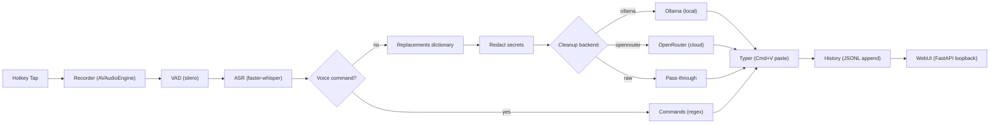
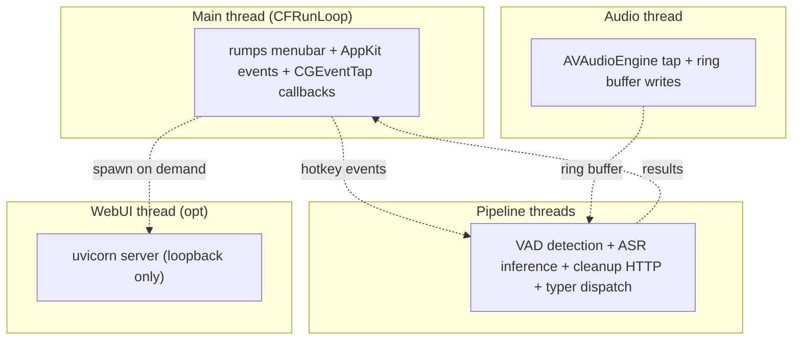

# Architecture

## Overview

dictate is a privacy-first macOS voice dictation app that records speech on a hotkey, transcribes it locally, optionally cleans it up, and inserts the result into the focused app. The default path keeps speech-to-text, cleanup, history, and the WebUI on the local Mac, with OpenRouter available only when explicitly enabled. The app is built as a small pipeline of single-responsibility modules coordinated by `dictate.app`, with macOS permissions and system frameworks providing microphone capture, event taps, accessibility context, and synthetic paste. Runtime data is intentionally simple: in-memory audio, plaintext local history, YAML config, structured logs, and cached model weights.

## Dictation pipeline

## Threading model

## Module map

| Module | Responsibility |
|---|---|
| `dictate/__init__.py` | Package marker and import boundary. |
| `dictate/__main__.py` | CLI entry point for app startup, `doctor`, `--version`, and `--dry-run`. |
| `dictate/_filelock.py` | Small advisory file-locking helper for safe local file updates. |
| `dictate/app.py` | Application wiring, lifecycle, pipeline orchestration, menu callbacks, and WebUI launch. |
| `dictate/asr.py` | ASR dispatcher plus `faster-whisper` transcription and confidence reporting. |
| `dictate/asr_apple.py` | Apple speech-recognition backend integration. |
| `dictate/asr_mlx.py` | Opt-in MLX Whisper backend for faster Apple Silicon transcription. |
| `dictate/audio_cues.py` | Optional start/stop/cancel audio feedback. |
| `dictate/cleanup.py` | Backend-agnostic cleanup client for Ollama, OpenRouter, and raw fallback. |
| `dictate/commands.py` | Regex voice-command parsing and command payload generation. |
| `dictate/config.py` | YAML config loading, schema/default handling, paths, and accessors. |
| `dictate/conflicts.py` | macOS dictation, Voice Control, hotkey, and app conflict detection. |
| `dictate/context.py` | Frontmost app detection, preset selection, and Accessibility selection reads. |
| `dictate/doctor.py` | Diagnostic subcommand for environment, config, permissions, and backend health. |
| `dictate/endpoint.py` | Automatic endpoint detection for stopping utterances after silence. |
| `dictate/health.py` | Backend health monitoring, fallback state, and circuit-breaker behavior. |
| `dictate/history.py` | Plaintext JSONL history append, read, purge, export, and reveal helpers. |
| `dictate/hotkey.py` | CGEventTap hotkey state machine for hold, tap, double-tap, cancel, and pause. |
| `dictate/hotkey_config.py` | Hotkey parsing, formatting, validation, and config updates. |
| `dictate/hud.py` | Click-through AppKit HUD for transient status and warnings. |
| `dictate/icons.py` | Status icon rendering and icon assets for menu/indicator states. |
| `dictate/indicator.py` | Optional on-screen recording/status indicator. |
| `dictate/launch_agent.py` | macOS LaunchAgent install, uninstall, and status helpers. |
| `dictate/learn.py` | Correction capture and few-shot examples for future cleanup prompts. |
| `dictate/logging_setup.py` | Structured JSON logging setup and per-utterance metrics logging. |
| `dictate/menubar.py` | rumps menu bar UI, toggles, dialogs, and callbacks into the app. |
| `dictate/onboarding.py` | First-run wizard for permissions, mic test, backend check, and hotkey confirmation. |
| `dictate/permissions.py` | Accessibility, Microphone, and Input Monitoring checks plus Settings deep links. |
| `dictate/project_detect.py` | Project/repository detection for project-specific vocabulary. |
| `dictate/punctuate.py` | Lightweight punctuation and text-normalization fallback helpers. |
| `dictate/recorder.py` | AVAudioEngine microphone capture, ring buffer, device changes, and VU level. |
| `dictate/redact.py` | Regex-driven secret scanner and transcript redaction. |
| `dictate/replacements.py` | Deterministic replacement dictionary loading and application. |
| `dictate/typer.py` | Secure-input guard, clipboard paste insertion, clipboard restore, and fallback typing. |
| `dictate/url_scheme.py` | `dictate://` URL parsing and dispatch to app automation actions. |
| `dictate/vad.py` | silero VAD streaming, speech detection, and silence trimming. |
| `dictate/vocab.py` | Context and project vocabulary loading, merging, and ASR prompt generation. |

## Data flow

Audio lives in an in-memory ring buffer and is never written to disk by the dictation pipeline. Transcripts and metadata are appended to `history.jsonl` in plaintext for local review and export. Configuration is read from `config/*.yaml` once at startup, with user-facing vocabulary and replacement files also under `config/`. The default ASR backend is `faster-whisper`; Apple Silicon users can opt into MLX Whisper with `asr.backend: mlx` after installing `mlx-whisper`, while Apple SFSpeech remains available as `apple`. Model weights are cached by HuggingFace under `~/.cache/huggingface/hub/`, and logs are written as structured JSON to `logs/dictate-*.log`.

## Process boundaries

Everything under `dictate/` runs in the dictate Python process, including hotkey handling, audio capture coordination, VAD, ASR invocation, cleanup routing, redaction, typing, history writes, the menu bar, HUD, onboarding, and the optional loopback WebUI thread. External local dependencies include macOS frameworks such as AVFoundation, AppKit, Accessibility, CoreGraphics/CGEvent, and the Ollama daemon on `localhost:11434` when the Ollama backend is enabled. The only remote process boundary is the OpenRouter HTTPS API, and it is used only when explicitly opted in through configuration and credentials.