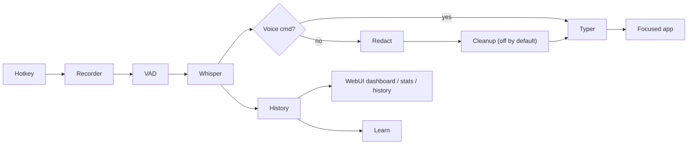

# dictate

> Privacy-first macOS voice dictation. Local Whisper on-device, with optional
> LLM cleanup through **Ollama** (local) or **OpenRouter** (cloud). No telemetry,
> no account, no required network calls.

<div class="dictate-chips" markdown>
  <span class="dictate-chip">🔒 <strong>Local-by-default</strong> — audio never leaves your Mac</span>
  <span class="dictate-chip">⌨️ Hotkey driven — hold, tap, double-tap</span>
  <span class="dictate-chip">🦙 Ollama or 🛰 OpenRouter for optional cleanup</span>
  <span class="dictate-chip">🧰 WebUI dashboard, stats, history, search</span>
  <span class="dictate-chip">📜 MIT licensed</span>
</div>

!!! info "Status"
    **v0.1.0** initial public release. CodeQL and Bandit run on every PR;
    OSSF Scorecard runs on push to main and on a weekly schedule.
    Branch protection requires code-owner review.
    See the [Roadmap](roadmap.md) and [Changelog](changelog.md).

## Why dictate?

- **Local by default.** On-device Whisper ASR. The default cleanup pipeline
  ships with the LLM **disabled** — you get raw transcription + smart
  punctuation, no network calls. Flip the toggle in the WebUI any time.
- **Two opt-in backends.** When you want LLM cleanup, choose:
    - **Ollama** — runs entirely on your Mac. Auto-picks the best installed
      model (≥3B), falls back if your configured one isn't pulled.
    - **OpenRouter** — single key, hundreds of models. Use only if you want to.
- **Hotkey driven.** Hold, tap, or double-tap your chosen key. Transcripts
  are pasted into the focused app via the system pasteboard.
- **Developer ergonomics.** Per-app vocab presets, voice commands, code-
  grammar mode, automatic secret redaction (API keys, tokens, AWS keys).
- **Built-in WebUI** at <http://127.0.0.1:47843> — dashboard with sparkline,
  stats with percentile latencies, full history with search/export, settings
  with one-click toggles. Loopback only, CSRF protected, dark-mode aware.
- **Open source, hardened.** MIT licensed, pinned-SHA GitHub Actions,
  CodeQL on three languages, OSSF Scorecard, no telemetry.
  [Read the code](https://github.com/lewiswigmore/macOS-dictate).

## Quick start

```bash
git clone https://github.com/lewiswigmore/macOS-dictate.git ~/dictate
cd ~/dictate
./install.sh
dictate
```

Open the WebUI dashboard at <http://127.0.0.1:47843> once the menu-bar app
is running. See [Install](usage.md) for full setup, [Permissions](permissions.md)
for the macOS perms you'll grant (Accessibility, Microphone, Input Monitoring),
and [First run](first-run.md) for the onboarding wizard.

## What's in the box

| Surface           | What it does |
|-------------------|--------------|
| **Menu-bar app**  | Hotkey state machine, HUD, recorder, ASR, paste insertion |
| **WebUI**         | Dashboard, stats, history, settings — all loopback-only |
| **Voice commands**| In-utterance editing: `period`, `new line`, `delete that`, etc. |
| **Presets**       | Per-app vocab (`code`, `chat`, `prose`) auto-applied by frontmost app |
| **Doctor**        | `dictate doctor` health-checks models, permissions, backends |
| **CLI**           | `dictate`, `dictate doctor`, `dictate restart`, `dictate-web` |

## What it isn't

- **Not a meeting transcriber.** Built for short, hotkey-triggered insertion.
- **Not a replacement for Apple's Dictation** if basic speech-to-text is
  enough and you trust their servers.
- **Not yet a packaged consumer app.** Source install only; `.app`, signed
  DMG, and Homebrew distribution are on the [Roadmap](roadmap.md).

## Architecture at a glance



See the full [architecture diagram](architecture.md) and [threat model](threat-model.md).

## Security & supply chain

- All GitHub Actions pinned to commit SHAs, hardened runner egress audit.
- CodeQL (`python`, `javascript-typescript`, `actions`), Bandit and
  pip-audit run on every PR. OSSF Scorecard runs on push to main and on
  a weekly schedule.
- Secret-scanning + push protection enabled.
- Branch protection: required code-owner review, dismiss stale, linear
  history, conversation resolution, `enforce_admins: true`.
- Loopback-only WebUI with custom-header CSRF defence (`X-Dictate-WebUI: 1`
  on mutating requests), strict CSP (`frame-ancestors 'none'`), per-request
  DICTATION prompt-fence nonce, symlink-aware chmod on history file.

Report security issues via [GitHub Security Advisories](https://github.com/lewiswigmore/macOS-dictate/security/advisories/new), not public issues.
